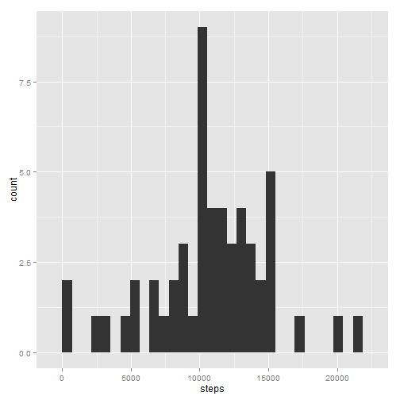
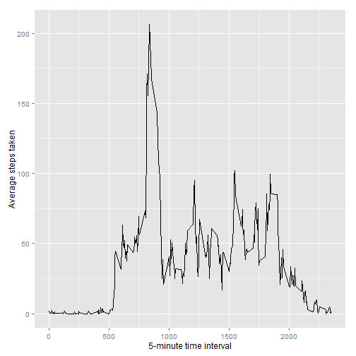
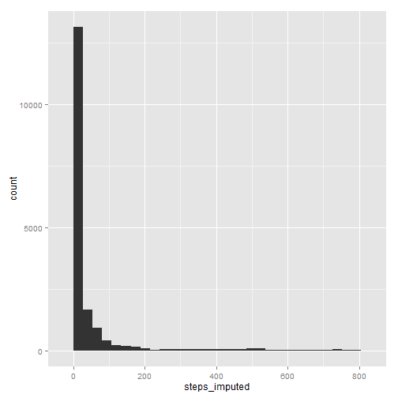

# Steps Activity Analyses
## Jordan A. Kempker, MD, MSc

2016-01-08
----

# Introduction

This analysis uses data collected from a personal activity monitoring device.  Data includes the number of steps from a single individual collected in 5 minute intervals throughout each 24 hour day from October through November, 2012.


The variables in the dataset are:


* __steps:__ integer variable of steps for each 5-minute interval (missing values coded as __NA__)
* __date:__ character variable of date which measurement was recorded in YYY-MM-DD format
* __interval:__ integer variable of the time interval measurement was recorded in 2400 military time format


The dataset is stored in a comma-separated-value (CSV) with a total of 17,568 variables.


The R packages you will need to manually install (with ```install.packages()```) to run this analysis are:


* __stringr:__  for the ```str_pad()``` function
* __dplyr:__ for some nifty dataset management functions 
* __ggplot2:__ my favorite plotting system for R

Here is the code you will need to use:

```r
install.packages("stringr")

install.packages("dplyr")

install.packages("ggplot2")
```


---------------

# Downloading and Processing the Data

1. The data can be downloaded from my GitHub site, [here](https://github.com/jkempker/Activity/blob/master/repdata_data_activity.zip).

2. Set your own working directory with ```setwd()```.

3. Unzip the file and read into an R dataframe we will name __act__:


```r
unzip("./repdata_data_activity.zip")  
act <- read.csv("./activity.csv", stringsAsFactors = FALSE)
```

4. To join the date and time interval variables into one POSIXct formatted time variable
    + __interval__ is converted from integer to character and left padded with zeroes for fixed length = 4
    + __interval__ character is pasted to the __date__ then ```strptime()``` used to format


```r
act$interval_char <- as.character(act$interval)
act$interval_char <- str_pad(act$interval_char, 4, side = c("left"), pad ="0")
act$time_char <- paste(act$date, act$interval_char)
act$time <- as.POSIXct(strptime(act$time_char, format = "%Y-%m-%d %H%M"))
```

5. There is a lot of missingness for __steps__, so we will create __steps_imputed__ that takes the imputes the average amount of steps for each time interval, averaged over the entire period wherever __steps__ is missing.


```r
act$interval_char <- as.factor(act$interval_char)
means <- as.numeric(with(act, tapply(steps, INDEX=interval_char, mean, na.rm=TRUE)))

#few data steps to merge these means back to full set, matching by time interval factor level
interval_char<- levels(act$interval_char)
n <- data.frame(interval_char,means)
act <- merge(act, n, by = "interval_char")
act <- mutate(act, steps_imputed = ifelse(is.na(steps), means, steps))
```

6. For the below analysis, we will visually compare step activity of weekdays with weekends
    + Create a factor variable for day of the week using nifty ```weekdays()``` function
    + Use ```dplyr:mutate()``` again to create the __day_cat__ factor variable


```r
act <- mutate(act, day = weekdays(time))
act <- mutate(act, day_cat = ifelse(day=="Sunday", "weekend",
                                    ifelse(day == "Saturday", "weekend","weekday")))
act$day_cat <- as.factor(act$day_cat)
with(act, table(day, day_cat)) #verify this tricky ifelse mutate worked
```

```
##            day_cat
## day         weekday weekend
##   Friday       2592       0
##   Monday       2592       0
##   Saturday        0    2304
##   Sunday          0    2304
##   Thursday     2592       0
##   Tuesday      2592       0
##   Wednesday    2592       0
```

7. Finally, clean up into a tidy dataframe, __activity__, and remove other temporary objects


```r
activity <- select(act, date, interval, time, steps, steps_imputed, day_cat) 
remove(act, n)
```

-------------
# Analysis
## Here we will pose a seris of questions and their answers.


1. Calculate the total number of steps taken per day.
    +Use ```aggregate()``` to sum up __steps__ over each __date__ (coerced into factor)
    +Other options would be to use ```tapply()``` or ```lapply(split())```.


```r
steps_per_day <- aggregate(steps ~ date, data = activity, FUN = sum, na.action = na.pass)
print(steps_per_day)
```

```
##          date steps
## 1  2012-10-01    NA
## 2  2012-10-02   126
## 3  2012-10-03 11352
## 4  2012-10-04 12116
## 5  2012-10-05 13294
## 6  2012-10-06 15420
## 7  2012-10-07 11015
## 8  2012-10-08    NA
## 9  2012-10-09 12811
## 10 2012-10-10  9900
## 11 2012-10-11 10304
## 12 2012-10-12 17382
## 13 2012-10-13 12426
## 14 2012-10-14 15098
## 15 2012-10-15 10139
## 16 2012-10-16 15084
## 17 2012-10-17 13452
## 18 2012-10-18 10056
## 19 2012-10-19 11829
## 20 2012-10-20 10395
## 21 2012-10-21  8821
## 22 2012-10-22 13460
## 23 2012-10-23  8918
## 24 2012-10-24  8355
## 25 2012-10-25  2492
## 26 2012-10-26  6778
## 27 2012-10-27 10119
## 28 2012-10-28 11458
## 29 2012-10-29  5018
## 30 2012-10-30  9819
## 31 2012-10-31 15414
## 32 2012-11-01    NA
## 33 2012-11-02 10600
## 34 2012-11-03 10571
## 35 2012-11-04    NA
## 36 2012-11-05 10439
## 37 2012-11-06  8334
## 38 2012-11-07 12883
## 39 2012-11-08  3219
## 40 2012-11-09    NA
## 41 2012-11-10    NA
## 42 2012-11-11 12608
## 43 2012-11-12 10765
## 44 2012-11-13  7336
## 45 2012-11-14    NA
## 46 2012-11-15    41
## 47 2012-11-16  5441
## 48 2012-11-17 14339
## 49 2012-11-18 15110
## 50 2012-11-19  8841
## 51 2012-11-20  4472
## 52 2012-11-21 12787
## 53 2012-11-22 20427
## 54 2012-11-23 21194
## 55 2012-11-24 14478
## 56 2012-11-25 11834
## 57 2012-11-26 11162
## 58 2012-11-27 13646
## 59 2012-11-28 10183
## 60 2012-11-29  7047
## 61 2012-11-30    NA
```

2. Make a histogram of total number of steps taken each day


```r
g <- ggplot(steps_per_day, aes(steps))+
    geom_histogram()
print(g)
```

```
## stat_bin: binwidth defaulted to range/30. Use 'binwidth = x' to adjust this.
```



3. Calculate the mean and median steps per day


```r
mean(steps_per_day$steps, na.rm = TRUE)
```

```
## [1] 10766.19
```

```r
median(steps_per_day$steps, na.rm = TRUE)
```

```
## [1] 10765
```

4. Make a time series plot with 5-minute interval on x-axis and average steps (averaged per interval over entire study period) on y-axis


```r
avg_steps_int <- aggregate(steps ~ interval, data = activity, FUN = mean)
ggplot(avg_steps_int, aes(interval, steps))+
    geom_path()+
    labs(x = "5-minute time interval", y = "Average steps taken")
```



5. Which interval has the most steps on average?


```r
with(avg_steps_int, max(steps), na.rm = TRUE)
```

```
## [1] 206.1698
```

```r
filter(avg_steps_int, steps == max(steps))
```

```
##   interval    steps
## 1      835 206.1698
```

6. Report the total number of missing values for steps
    +Here the missings are summed up as __TRUEs__ with the ```is.na()``` function


```r
table(is.na(activity$steps))
```

```
## 
## FALSE  TRUE 
## 15264  2304
```

7. Using the __steps_imputed__ variable created above, remake a histogram of step counts per interval and calculate __mean__ and __median__


```r
g <- ggplot(activity, aes(steps_imputed))+
    geom_histogram()
print(g)
```

```
## stat_bin: binwidth defaulted to range/30. Use 'binwidth = x' to adjust this.
```



```r
mean(activity$steps_imputed)
```

```
## [1] 37.3826
```

```r
median(activity$steps_imputed)
```

```
## [1] 0
```

8. Using __day_cat__ variable created above, which creates a factor varialbe grouping days by weeekends and weekdays, create a multipanel time series plot of average steps per time interval (averaged over entire study period grouped by weekday vs. weekend) to compare.


```r
avg_steps_weekend <- aggregate(steps ~ day_cat + interval, data = activity, FUN = mean)

g <- ggplot(avg_steps_weekend, aes(interval, steps))+
    geom_path()+
    facet_grid( day_cat ~ .)
print(g)
```


